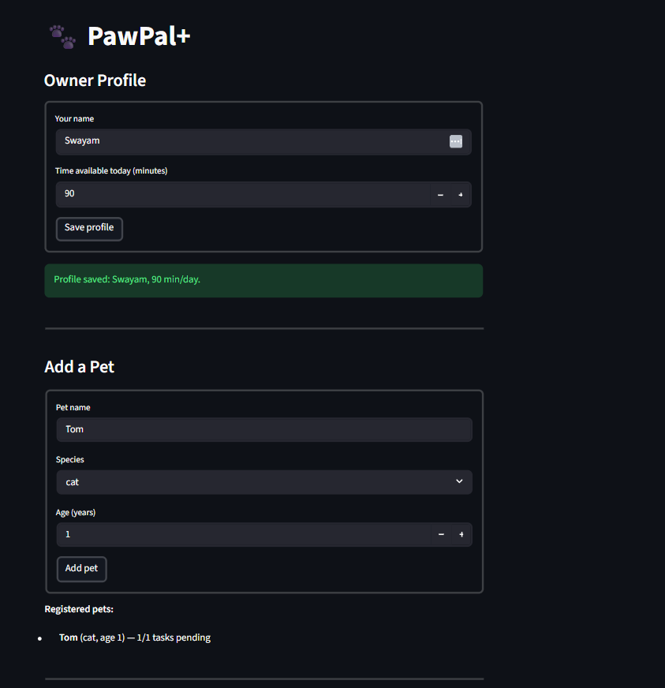
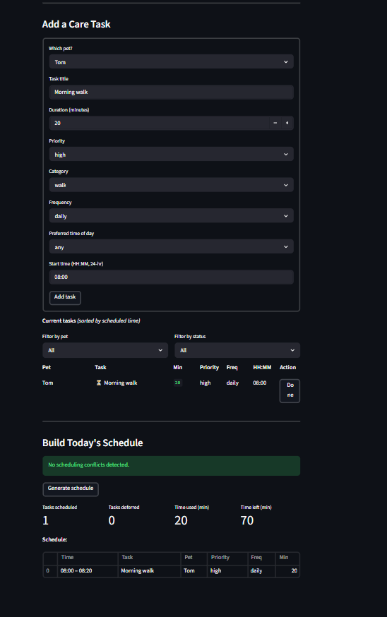

# PawPal+ (Module 2 Project)

You are building **PawPal+**, a Streamlit app that helps a pet owner plan care tasks for their pet.

## Scenario

A busy pet owner needs help staying consistent with pet care. They want an assistant that can:

- Track pet care tasks (walks, feeding, meds, enrichment, grooming, etc.)
- Consider constraints (time available, priority, owner preferences)
- Produce a daily plan and explain why it chose that plan

Your job is to design the system first (UML), then implement the logic in Python, then connect it to the Streamlit UI.

## What you will build

Your final app should:

- Let a user enter basic owner + pet info
- Let a user add/edit tasks (duration + priority at minimum)
- Generate a daily schedule/plan based on constraints and priorities
- Display the plan clearly (and ideally explain the reasoning)
- Include tests for the most important scheduling behaviors

## Getting started

### Setup

```bash
python -m venv .venv
source .venv/bin/activate  # Windows: .venv\Scripts\activate
pip install -r requirements.txt
```

## Features

| Feature                       | Description                                                                                                                                            |
| ----------------------------- | ------------------------------------------------------------------------------------------------------------------------------------------------------ |
| **Multi-pet support**         | Register any number of pets under one owner; each pet has its own task list                                                                            |
| **Task management**           | Add tasks with title, duration, priority (high/medium/low), category, frequency, preferred time of day, and a specific HH:MM start time                |
| **Sorting by time**           | All tasks are displayed in chronological order using a lambda key that converts HH:MM strings to minutes-since-midnight for correct numeric comparison |
| **Filtering**                 | Filter the task list by pet name and/or completion status (pending / completed)                                                                        |
| **Daily schedule generation** | Greedy scheduler fits pending tasks within the owner's daily time budget, ordered by preferred time slot → priority → title                            |
| **Conflict warnings**         | Detects same-time collisions, duplicate task categories per pet, and budget overflow — shown as colour-coded alerts before schedule generation         |
| **Recurring tasks**           | Marking a daily task done auto-creates the next occurrence for tomorrow; weekly tasks reappear in 7 days; one-off tasks simply close out               |
| **Deferred task report**      | Tasks that don't fit in the budget are listed separately with the reason they were skipped                                                             |

## Smarter Scheduling

PawPal+ now includes four algorithmic features that make the daily planner more intelligent:

- **Sorting by time** — `Scheduler.sort_by_time()` orders any list of tasks chronologically using a lambda key that converts each task's `HH:MM` string to minutes since midnight, ensuring correct numeric ordering regardless of string length.

- **Filtering by pet or status** — `Scheduler.filter_tasks()` accepts an optional pet name and/or a completion status (`"pending"` or `"completed"`) and returns only the matching `(pet, task)` pairs, making it easy to focus on one animal's workload or review what's already done.

- **Recurring tasks** — `Scheduler.mark_task_complete()` marks a task done and automatically creates the next occurrence using Python's `timedelta`: daily tasks reappear tomorrow (`+ timedelta(days=1)`), weekly tasks reappear in seven days (`+ timedelta(weeks=1)`). One-off `"as-needed"` tasks are simply marked complete with no successor.

- **Conflict detection** — `Scheduler.get_conflicts()` returns human-readable warnings for three conflict types: (1) two or more tasks requesting the exact same `HH:MM` start time, (2) a pet having multiple pending tasks in the same category (e.g., two "walk" entries), and (3) total pending time exceeding the owner's daily budget. The checker returns warning strings rather than raising exceptions, so the app stays running and the user can decide how to resolve each issue.

## Testing PawPal+

Run the full test suite from the project root:

```bash
python -m pytest
```

The suite contains **21 tests** across five areas:

| Area               | What is verified                                                                                                                                                                    |
| ------------------ | ----------------------------------------------------------------------------------------------------------------------------------------------------------------------------------- |
| Task / Pet basics  | `mark_complete()` sets `completed=True`; `add_task()` grows the task list                                                                                                           |
| Sorting            | Tasks added out of order are returned chronologically; same-hour tasks sort by minute; empty list is handled                                                                        |
| Filtering          | `filter_tasks()` isolates by pet name, by pending status, by completed status, and returns nothing for a pet with no tasks                                                          |
| Recurring tasks    | Daily tasks get a next-day occurrence; weekly tasks get a next-week occurrence; `as-needed` tasks produce no successor; the new task inherits all fields and starts incomplete      |
| Conflict detection | Same-time collisions are flagged; different times produce no warning; duplicate categories are caught; budget overflow is caught; completed tasks are excluded from conflict checks |

**Confidence level: ★★★★☆** — all happy paths and the most likely edge cases are covered. Interval-overlap detection (e.g. a 30-min task at 08:00 overlapping a task at 08:20) and multi-pet scheduling edge cases would be the next things to add.

### DEMO

<a href="image1.png" target="_blank"></a>
<a href="image2.png" target="_blank"></a>

### Suggested workflow

1. Read the scenario carefully and identify requirements and edge cases.
2. Draft a UML diagram (classes, attributes, methods, relationships).
3. Convert UML into Python class stubs (no logic yet).
4. Implement scheduling logic in small increments.
5. Add tests to verify key behaviors.
6. Connect your logic to the Streamlit UI in `app.py`.
7. Refine UML so it matches what you actually built.
