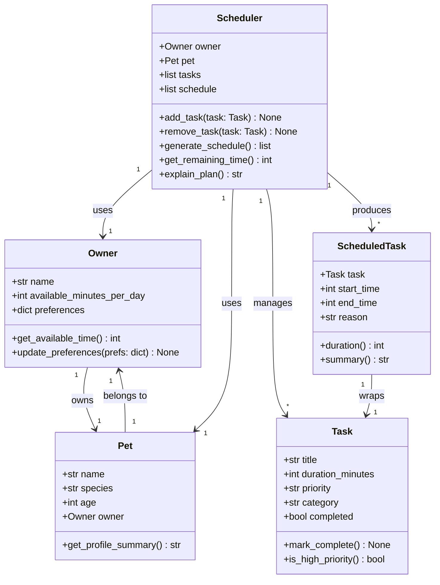

# PawPal+ Project Reflection

## 1. System Design

**a. Initial design**

Three core actions a user should be able to perform:

1. **Set up an owner and pet profile.** The user enters basic information about themselves (name, how much time they have available each day) and their pet (name, species, age). This information provides the context the scheduler needs to make sensible decisions — for example, a puppy may need more frequent walks than an older dog, and a busy owner with only 90 minutes per day cannot fit an hour-long grooming session on top of three walks.

2. **Add and edit care tasks.** The user builds a list of tasks the pet needs, such as a morning walk, evening feeding, medication, or enrichment play. Each task has at minimum a name, an estimated duration, and a priority level (e.g., high/medium/low). The user can revisit this list to change durations, adjust priorities, or remove tasks that are no longer relevant — keeping the schedule accurate over time.

3. **Generate and view a daily plan.** The user requests a schedule for the day. The system evaluates all pending tasks against the owner's available time and each task's priority, then produces an ordered plan that fits within the time budget. The plan is displayed clearly, and the app explains why tasks were included or excluded — for instance, noting that a low-priority grooming task was deferred because the total time would have exceeded the daily limit.

The initial design uses five classes, each with a distinct responsibility:

- **`Owner`** is a pure data object representing the person using the app. Its most important attribute is `available_minutes_per_day`, which acts as the hard time budget the scheduler must not exceed. The `preferences` dict is a flexible store for future options (e.g., prefers morning walks, avoids grooming on weekdays). `Owner` has no scheduling logic — it only answers questions about itself.

- **`Pet`** is also a data object. It holds the pet's name, species, and age. These three fields give the scheduler (and eventually the UI) enough context to describe the plan in a natural way. `Pet` holds a reference to its `Owner` so that any part of the system that has a `Pet` can trace back to the owner's constraints without needing to pass both objects everywhere.

- **`Task`** represents a single unit of care work — one walk, one feeding, one medication dose. It knows its own duration, priority, and category, but has no opinion about when it runs or whether it fits in the day. `is_high_priority()` is a convenience predicate so the scheduler does not need to compare strings repeatedly. `mark_complete()` lets tasks be checked off once the day is underway.

- **`Scheduler`** is the only class with real logic. It holds the full task list and, once run, the resulting schedule. `generate_schedule()` is the core method: it sorts tasks by priority, walks the list, fits each task into the remaining time budget, and records a reason for each inclusion or exclusion. `explain_plan()` renders the reasoning as a human-readable string for the UI. `get_remaining_time()` subtracts the sum of scheduled task durations from the owner's daily budget.

- **`ScheduledTask`** is a read-only output wrapper produced by `Scheduler`. It pairs a `Task` with a concrete start and end time (stored as minutes from midnight, e.g. 480 = 8:00 AM) and a plain-English `reason`. The UI only needs to read `ScheduledTask` objects — it never writes to them.

**Relationships and identified bottlenecks:**

| Relationship | Multiplicity | Note |
|---|---|---|
| `Owner` → `Pet` | 1 to 1 | Owner is referenced by Pet; Owner does not hold a back-reference to Pet |
| `Scheduler` → `Owner` | 1 to 1 | Scheduler reads `available_minutes_per_day` as the time budget |
| `Scheduler` → `Pet` | 1 to 1 | Scheduler uses Pet for plan descriptions; no logic dependency |
| `Scheduler` → `Task` | 1 to many | Scheduler owns the task list; tasks are passive |
| `Scheduler` → `ScheduledTask` | 1 to many | Produced only after `generate_schedule()` is called |
| `ScheduledTask` → `Task` | 1 to 1 | Wraps exactly one Task with timing and reason |

**Bottlenecks identified before implementation:**

1. `generate_schedule()` must run before `explain_plan()` or `get_remaining_time()` are meaningful. Calling those methods on an empty schedule is a silent failure risk. The implementation should guard against this (e.g., raise an error or return a clear message if the schedule has not been generated yet).

2. `Scheduler` tracks the *included* tasks via `self.schedule`, but has no store for *excluded* tasks and their reasons. Without this, `explain_plan()` can only describe what made the cut — it cannot tell the user why a task was skipped. A second list (`excluded: list[ScheduledTask]`) is needed to give complete explanations.

3. The `Owner ↔ Pet` circular reference (`Pet` holds `Owner`, Mermaid diagram showed `Owner` holds `Pet`) was simplified: only `Pet` holds a reference to `Owner`. `Owner` does not need to know about `Pet` to fulfill its responsibility, and avoiding the back-reference prevents circular dependency issues when serialising data later.

**Class diagram (Mermaid.js):**

**b. Design changes**

Three gaps were found during the design review, before any implementation:

1. **Added `excluded` list to `Scheduler`.** The original design only tracked `self.schedule` (included tasks). Without a parallel list for excluded tasks, `explain_plan()` could not tell the user *why* something was skipped. The fix is a second attribute `excluded: list[ScheduledTask]` populated during `generate_schedule()` with a reason such as `"skipped: would exceed daily time budget"`. This makes explanations complete without adding a new class.

2. **Removed the `Owner → Pet` back-reference.** The Mermaid diagram initially showed a bidirectional link (`Owner` owns `Pet`, `Pet` belongs to `Owner`). In practice, `Owner` never needs to look up its `Pet` — the `Scheduler` already holds both. The back-reference was dropped to keep `Owner` a simple, flat data object and avoid a circular reference that would complicate equality checks and serialisation.

3. **Clarified method ordering dependency.** `explain_plan()` and `get_remaining_time()` are only meaningful after `generate_schedule()` runs. This implicit ordering will be enforced in the implementation by raising a `RuntimeError` if the schedule list is empty when either method is called, making the dependency explicit rather than a hidden silent failure.

---

## 2.Core Implementation 

**a. Constraints and priorities**

The scheduler considers three constraints, ordered from hardest to softest:

1. **Time budget (hard constraint).** `available_minutes_per_day` is a strict ceiling — once the running total of scheduled task durations would exceed it, the remaining tasks are deferred rather than squeezed in. This is the most important constraint because it reflects a real-world physical limit: an owner only has so many waking hours.

2. **Priority (medium constraint).** Tasks are sorted high → medium → low before scheduling, so a high-priority medication is placed before a low-priority grooming session even if the grooming was added first. Priority was chosen as the second constraint because missing a medication dose has a direct health consequence, whereas a delayed brushing session does not.

3. **Preferred time of day (soft constraint).** Tasks are first bucketed into morning, afternoon, and evening slots. The scheduler advances its cursor to the start of each slot when it encounters a task that belongs there, but if the cursor has already passed that point the task is placed at the current time rather than being deferred. This keeps the schedule feeling natural without sacrificing the hard budget constraint.

**b. Tradeoffs**

**Tradeoff: exact-time conflict matching instead of overlap detection.**

`get_conflicts()` flags two tasks as conflicting only when their `time` fields are an exact string match (e.g., both set to `"08:00"`). It does *not* detect partial overlaps — for example, a 30-minute task starting at `"08:00"` and a 15-minute task starting at `"08:20"` would collide in real life but pass the check undetected.

This is a reasonable tradeoff for a simple daily planner for two reasons. First, most pet-care tasks are assigned to coarse time slots (morning, afternoon, evening) rather than precise minute-level windows, so exact-time clashes are the most common and actionable conflicts a pet owner would actually encounter. Second, full interval-overlap detection would require converting every task's start time and duration into an interval, then comparing every pair — O(n²) logic that adds code complexity without meaningful benefit at the scale of a handful of daily tasks. If the app were extended to support calendar-style scheduling with precise durations, interval arithmetic would be worth adding.

---

## 3. AI Collaboration

**a. How I used AI**

AI tools were used at every stage of the project, but the role shifted across phases:

- **Phase 1 (design):** Used AI to brainstorm which classes were needed and what responsibilities each should have. The most useful prompt format was "Given this scenario, what are the distinct responsibilities that should be modeled as separate classes?" This produced a clean separation between `Owner` (time budget), `Pet` (task container), `Task` (unit of work), `Scheduler` (logic), and `ScheduledTask` (output wrapper).

- **Phase 3 (algorithms):** Used AI to research `timedelta` for recurring task date arithmetic and to draft the lambda key for `sort_by_time()`. The prompt "How do I sort a list of objects by an HH:MM string field without using datetime.strptime?" produced the `int(t[:2]) * 60 + int(t[3:])` conversion, which is concise and avoids importing `datetime` just for parsing.

- **Phase 5 (testing):** Used AI to identify edge cases I had not considered, specifically the "completed task should be invisible to conflict detection" case. The prompt "What are the most important edge cases to test for a pet scheduler with recurring tasks and conflict detection?" surfaced that case and the empty-list sorting test.

**Using separate chat sessions per phase** made a significant practical difference. Each new session starts with no accumulated context from prior work, which forced every prompt to be self-contained and specific. In a single long session, earlier design decisions tend to bleed into later suggestions — the AI assumes the current approach is correct and builds on it rather than questioning it. Starting fresh for Phase 3 (algorithms) and again for Phase 5 (testing) meant the AI had no loyalty to earlier design choices, making it easier to get honest feedback like "this conflict check only catches exact matches, not overlaps." It also prevented the context window from filling with irrelevant class skeleton code when asking about test edge cases.

**b. Judgment and verification**

During Phase 3, the AI initially suggested implementing full interval-overlap conflict detection — comparing every pair of tasks using their start time plus duration to find overlaps. The suggested code used a nested loop (O(n²)) and added about 25 lines of interval arithmetic.

I evaluated the suggestion against the actual use case: a pet owner with a handful of daily tasks, most assigned to coarse slots like "morning" or "evening." At that scale, exact same-time matching catches the real problem (accidentally assigning two tasks to "08:00") without the complexity cost. The O(n²) interval check was rejected in favor of the O(n) grouping approach. The tradeoff was documented in reflection.md section 2b so a future developer would understand why the simpler version was a deliberate choice, not an oversight.

**c. AI Collaboration Q&A**

**Q: Which Copilot features were most effective for building your scheduler?**

The most effective feature was targeted prompt-based code generation for specific, well-defined problems. In Phase 1, asking "Given this scenario, what are the distinct responsibilities that should be modeled as separate classes?" produced a clean class breakdown with no wasted suggestions. In Phase 3, a focused prompt about sorting an HH:MM string field with a lambda key returned the exact `int(t[:2]) * 60 + int(t[3:])` conversion — precise and directly usable. In Phase 5, asking for edge cases in a pet scheduler with recurring tasks and conflict detection surfaced the "completed tasks should be invisible to conflict detection" case, which I had missed. In all three phases, the feature that added the most value was the AI's ability to generate a concrete, runnable starting point that I could evaluate and modify, rather than describing an approach in the abstract.

**Q: Give one example of an AI suggestion you rejected or modified to keep your system design clean.**

During Phase 3, the AI suggested implementing full interval-overlap conflict detection using a nested loop — comparing every pair of tasks by start time plus duration to catch partial overlaps. The suggested code was about 25 lines of interval arithmetic and ran in O(n²) time. I rejected it because the actual use case is a pet owner with a small handful of daily tasks assigned to coarse slots like "morning" or "evening." At that scale, exact same-time matching catches the real conflict (two tasks accidentally set to "08:00") without the added complexity. Accepting the AI's suggestion would have made the code harder to read and maintain for a problem that does not exist at this app's scale. The simpler O(n) approach was kept and the tradeoff was documented in section 2b so the decision would not look like an oversight to a future developer.

**Q: How did using separate chat sessions for different phases help you stay organized?**

Each new session started with no accumulated context from prior phases, which forced every prompt to be self-contained and specific. In a single long session, earlier design decisions tend to bleed into later suggestions — the AI assumes the current approach is correct and builds on it rather than questioning it. Starting fresh for Phase 3 (algorithms) and again for Phase 5 (testing) meant the AI had no loyalty to earlier choices, making it easier to get honest feedback like "this conflict check only catches exact matches, not overlaps." It also kept the context window clean: when asking about test edge cases, the session was not cluttered with the full class skeleton code from Phase 1. The discipline of opening a new session per phase mirrored the discipline of keeping the code layers separate — each session had one clear job.

---

## 4. Testing and Verification

**a. What you tested**

The test suite covers 21 behaviors across five areas:

- **Sorting** — tasks added out of order are returned chronologically; same-hour tasks sort by minute; an empty list is handled without error. These matter because the entire UI relies on `sort_by_time()` to display tasks in a readable order.
- **Filtering** — filtering by pet name returns only that pet's tasks; pending/completed filters exclude the opposite status; a pet with no tasks returns an empty list. These guard the most user-visible feature in the task management section.
- **Recurring tasks** — daily tasks get a next-day copy; weekly tasks get a next-week copy; `as-needed` tasks produce no successor; the new task starts incomplete and inherits all original fields. Recurring logic is the most stateful feature and the easiest to break silently.
- **Conflict detection** — same-time collision flagged; different times produce no false positive; duplicate categories caught; budget overflow caught; completed tasks are invisible to the checker. Conflict warnings are only useful if they don't cry wolf, so the false-positive test is as important as the true-positive tests.
- **Schedule generation** — total scheduled duration never exceeds the budget; tasks that don't fit land in `excluded`. These confirm the core scheduling invariant.

**b. Confidence**

**★★★★☆ (4/5).** All 21 tests pass and the cases cover the main happy paths and edge cases a real user would encounter. The missing star reflects two gaps: (1) interval-overlap detection is not tested because it is not implemented, so two tasks that overlap by duration (not exact time) would go undetected; (2) there are no tests for the Streamlit UI layer — the `app.py` wiring is verified only by manual inspection. If more time were available, the next tests would be: a multi-pet conflict (same time across two different pets), an owner with zero minutes available, and a task whose duration exactly equals the remaining budget.

---

## 5. Reflection

**a. What went well**

The cleanest part of the project is the separation between the logic layer (`pawpal_system.py`) and the display layer (`app.py`). Every algorithmic method — sorting, filtering, conflict detection, recurring task creation — lives entirely in `Scheduler` and can be tested without Streamlit running at all. This made Phase 5 straightforward: 21 tests could be written against plain Python objects with no mocking required. Starting from a clear UML diagram in Phase 1 made it easy to keep that separation intact as the system grew.

**b. What you would improve**

The `Task.time` field is currently a plain string (`"08:00"`). This works for sorting and display, but it means the app trusts the user to enter a valid 24-hour time and has no validation if they type `"8:00"` or `"25:00"`. In the next iteration I would store time as a `datetime.time` object internally and only convert it to a string for display. That would also enable true interval-overlap detection, because you could compare `time + timedelta(minutes=duration)` to find genuine overlaps rather than only exact-time collisions.

**c. Key takeaway**

The most important lesson was that AI tools are strongest when you already have a clear problem statement and a design in mind. When I asked vague questions ("help me write a scheduler") the suggestions were generic and needed heavy editing. When I asked specific questions ("how do I sort a list of dataclass objects by an HH:MM string field using a lambda key") the output was precise and directly usable. The lead architect's job is not to write every line — it is to stay clear on what the system should do so that AI suggestions can be evaluated quickly and either accepted, modified, or rejected with a reason.
