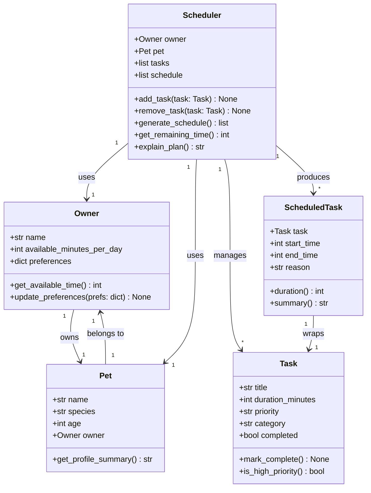

# PawPal+ Project Reflection

## 1. System Design

**a. Initial design**

Three core actions a user should be able to perform:

1. **Set up an owner and pet profile.** The user enters basic information about themselves (name, how much time they have available each day) and their pet (name, species, age). This information provides the context the scheduler needs to make sensible decisions — for example, a puppy may need more frequent walks than an older dog, and a busy owner with only 90 minutes per day cannot fit an hour-long grooming session on top of three walks.

2. **Add and edit care tasks.** The user builds a list of tasks the pet needs, such as a morning walk, evening feeding, medication, or enrichment play. Each task has at minimum a name, an estimated duration, and a priority level (e.g., high/medium/low). The user can revisit this list to change durations, adjust priorities, or remove tasks that are no longer relevant — keeping the schedule accurate over time.

3. **Generate and view a daily plan.** The user requests a schedule for the day. The system evaluates all pending tasks against the owner's available time and each task's priority, then produces an ordered plan that fits within the time budget. The plan is displayed clearly, and the app explains why tasks were included or excluded — for instance, noting that a low-priority grooming task was deferred because the total time would have exceeded the daily limit.

- What classes did you include, and what responsibilities did you assign to each?

**Object brainstorm:**

| Object | Attributes | Methods |
|---|---|---|
| `Owner` | `name`, `available_minutes_per_day`, `preferences` | `get_available_time()`, `update_preferences()` |
| `Pet` | `name`, `species`, `age`, `owner` | `get_profile_summary()` |
| `Task` | `title`, `duration_minutes`, `priority`, `category`, `completed` | `mark_complete()`, `is_high_priority()` |
| `Scheduler` | `owner`, `pet`, `tasks`, `schedule` | `add_task()`, `remove_task()`, `generate_schedule()`, `get_remaining_time()`, `explain_plan()` |
| `ScheduledTask` | `task`, `start_time`, `end_time`, `reason` | `duration()`, `summary()` |

**Responsibilities:**
- `Owner` and `Pet` are data-holding objects that provide context to the scheduler — the owner's available time acts as the primary constraint.
- `Task` represents a single unit of pet care work. It knows its own duration and priority but has no scheduling logic.
- `Scheduler` is the core logic object. It takes the full task list, filters and orders tasks to fit within the owner's time budget, and produces a list of `ScheduledTask` objects with explanations.
- `ScheduledTask` is a lightweight output wrapper — it pairs a `Task` with a computed start/end time and a human-readable reason, making it easy for the UI to display the plan clearly.

**Class diagram (Mermaid.js):**

**b. Design changes**

- Did your design change during implementation?
- If yes, describe at least one change and why you made it.

---

## 2. Scheduling Logic and Tradeoffs

**a. Constraints and priorities**

- What constraints does your scheduler consider (for example: time, priority, preferences)?
- How did you decide which constraints mattered most?

**b. Tradeoffs**

- Describe one tradeoff your scheduler makes.
- Why is that tradeoff reasonable for this scenario?

---

## 3. AI Collaboration

**a. How you used AI**

- How did you use AI tools during this project (for example: design brainstorming, debugging, refactoring)?
- What kinds of prompts or questions were most helpful?

**b. Judgment and verification**

- Describe one moment where you did not accept an AI suggestion as-is.
- How did you evaluate or verify what the AI suggested?

---

## 4. Testing and Verification

**a. What you tested**

- What behaviors did you test?
- Why were these tests important?

**b. Confidence**

- How confident are you that your scheduler works correctly?
- What edge cases would you test next if you had more time?

---

## 5. Reflection

**a. What went well**

- What part of this project are you most satisfied with?

**b. What you would improve**

- If you had another iteration, what would you improve or redesign?

**c. Key takeaway**

- What is one important thing you learned about designing systems or working with AI on this project?
