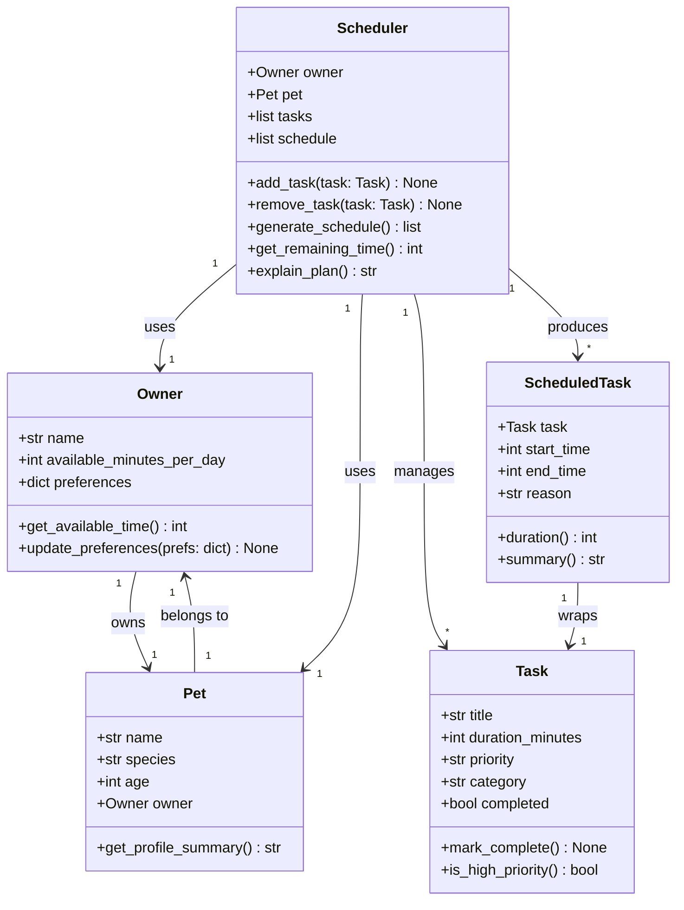

# PawPal+ Project Reflection

## 1. System Design

**a. Initial design**

Three core actions a user should be able to perform:

1. **Set up an owner and pet profile.** The user enters basic information about themselves (name, how much time they have available each day) and their pet (name, species, age). This information provides the context the scheduler needs to make sensible decisions — for example, a puppy may need more frequent walks than an older dog, and a busy owner with only 90 minutes per day cannot fit an hour-long grooming session on top of three walks.

2. **Add and edit care tasks.** The user builds a list of tasks the pet needs, such as a morning walk, evening feeding, medication, or enrichment play. Each task has at minimum a name, an estimated duration, and a priority level (e.g., high/medium/low). The user can revisit this list to change durations, adjust priorities, or remove tasks that are no longer relevant — keeping the schedule accurate over time.

3. **Generate and view a daily plan.** The user requests a schedule for the day. The system evaluates all pending tasks against the owner's available time and each task's priority, then produces an ordered plan that fits within the time budget. The plan is displayed clearly, and the app explains why tasks were included or excluded — for instance, noting that a low-priority grooming task was deferred because the total time would have exceeded the daily limit.

The initial design uses five classes, each with a distinct responsibility:

- **`Owner`** is a pure data object representing the person using the app. Its most important attribute is `available_minutes_per_day`, which acts as the hard time budget the scheduler must not exceed. The `preferences` dict is a flexible store for future options (e.g., prefers morning walks, avoids grooming on weekdays). `Owner` has no scheduling logic — it only answers questions about itself.

- **`Pet`** is also a data object. It holds the pet's name, species, and age. These three fields give the scheduler (and eventually the UI) enough context to describe the plan in a natural way. `Pet` holds a reference to its `Owner` so that any part of the system that has a `Pet` can trace back to the owner's constraints without needing to pass both objects everywhere.

- **`Task`** represents a single unit of care work — one walk, one feeding, one medication dose. It knows its own duration, priority, and category, but has no opinion about when it runs or whether it fits in the day. `is_high_priority()` is a convenience predicate so the scheduler does not need to compare strings repeatedly. `mark_complete()` lets tasks be checked off once the day is underway.

- **`Scheduler`** is the only class with real logic. It holds the full task list and, once run, the resulting schedule. `generate_schedule()` is the core method: it sorts tasks by priority, walks the list, fits each task into the remaining time budget, and records a reason for each inclusion or exclusion. `explain_plan()` renders the reasoning as a human-readable string for the UI. `get_remaining_time()` subtracts the sum of scheduled task durations from the owner's daily budget.

- **`ScheduledTask`** is a read-only output wrapper produced by `Scheduler`. It pairs a `Task` with a concrete start and end time (stored as minutes from midnight, e.g. 480 = 8:00 AM) and a plain-English `reason`. The UI only needs to read `ScheduledTask` objects — it never writes to them.

**Relationships and identified bottlenecks:**

| Relationship | Multiplicity | Note |
|---|---|---|
| `Owner` → `Pet` | 1 to 1 | Owner is referenced by Pet; Owner does not hold a back-reference to Pet |
| `Scheduler` → `Owner` | 1 to 1 | Scheduler reads `available_minutes_per_day` as the time budget |
| `Scheduler` → `Pet` | 1 to 1 | Scheduler uses Pet for plan descriptions; no logic dependency |
| `Scheduler` → `Task` | 1 to many | Scheduler owns the task list; tasks are passive |
| `Scheduler` → `ScheduledTask` | 1 to many | Produced only after `generate_schedule()` is called |
| `ScheduledTask` → `Task` | 1 to 1 | Wraps exactly one Task with timing and reason |

**Bottlenecks identified before implementation:**

1. `generate_schedule()` must run before `explain_plan()` or `get_remaining_time()` are meaningful. Calling those methods on an empty schedule is a silent failure risk. The implementation should guard against this (e.g., raise an error or return a clear message if the schedule has not been generated yet).

2. `Scheduler` tracks the *included* tasks via `self.schedule`, but has no store for *excluded* tasks and their reasons. Without this, `explain_plan()` can only describe what made the cut — it cannot tell the user why a task was skipped. A second list (`excluded: list[ScheduledTask]`) is needed to give complete explanations.

3. The `Owner ↔ Pet` circular reference (`Pet` holds `Owner`, Mermaid diagram showed `Owner` holds `Pet`) was simplified: only `Pet` holds a reference to `Owner`. `Owner` does not need to know about `Pet` to fulfill its responsibility, and avoiding the back-reference prevents circular dependency issues when serialising data later.

**Class diagram (Mermaid.js):**

**b. Design changes**

Three gaps were found during the design review, before any implementation:

1. **Added `excluded` list to `Scheduler`.** The original design only tracked `self.schedule` (included tasks). Without a parallel list for excluded tasks, `explain_plan()` could not tell the user *why* something was skipped. The fix is a second attribute `excluded: list[ScheduledTask]` populated during `generate_schedule()` with a reason such as `"skipped: would exceed daily time budget"`. This makes explanations complete without adding a new class.

2. **Removed the `Owner → Pet` back-reference.** The Mermaid diagram initially showed a bidirectional link (`Owner` owns `Pet`, `Pet` belongs to `Owner`). In practice, `Owner` never needs to look up its `Pet` — the `Scheduler` already holds both. The back-reference was dropped to keep `Owner` a simple, flat data object and avoid a circular reference that would complicate equality checks and serialisation.

3. **Clarified method ordering dependency.** `explain_plan()` and `get_remaining_time()` are only meaningful after `generate_schedule()` runs. This implicit ordering will be enforced in the implementation by raising a `RuntimeError` if the schedule list is empty when either method is called, making the dependency explicit rather than a hidden silent failure.

---

## 2. Scheduling Logic and Tradeoffs

**a. Constraints and priorities**

- What constraints does your scheduler consider (for example: time, priority, preferences)?
- How did you decide which constraints mattered most?

**b. Tradeoffs**

- Describe one tradeoff your scheduler makes.
- Why is that tradeoff reasonable for this scenario?

---

## 3. AI Collaboration

**a. How you used AI**

- How did you use AI tools during this project (for example: design brainstorming, debugging, refactoring)?
- What kinds of prompts or questions were most helpful?

**b. Judgment and verification**

- Describe one moment where you did not accept an AI suggestion as-is.
- How did you evaluate or verify what the AI suggested?

---

## 4. Testing and Verification

**a. What you tested**

- What behaviors did you test?
- Why were these tests important?

**b. Confidence**

- How confident are you that your scheduler works correctly?
- What edge cases would you test next if you had more time?

---

## 5. Reflection

**a. What went well**

- What part of this project are you most satisfied with?

**b. What you would improve**

- If you had another iteration, what would you improve or redesign?

**c. Key takeaway**

- What is one important thing you learned about designing systems or working with AI on this project?
